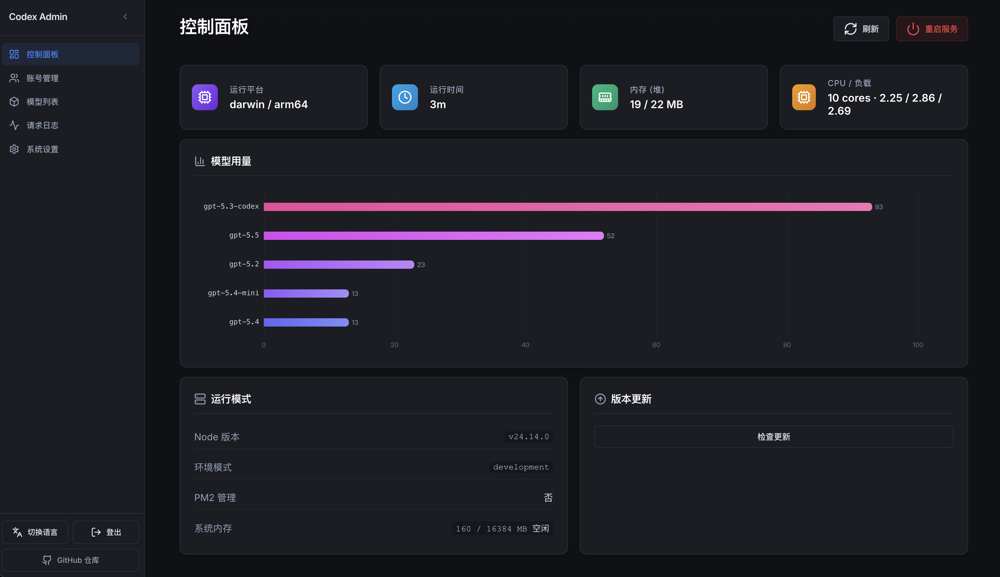
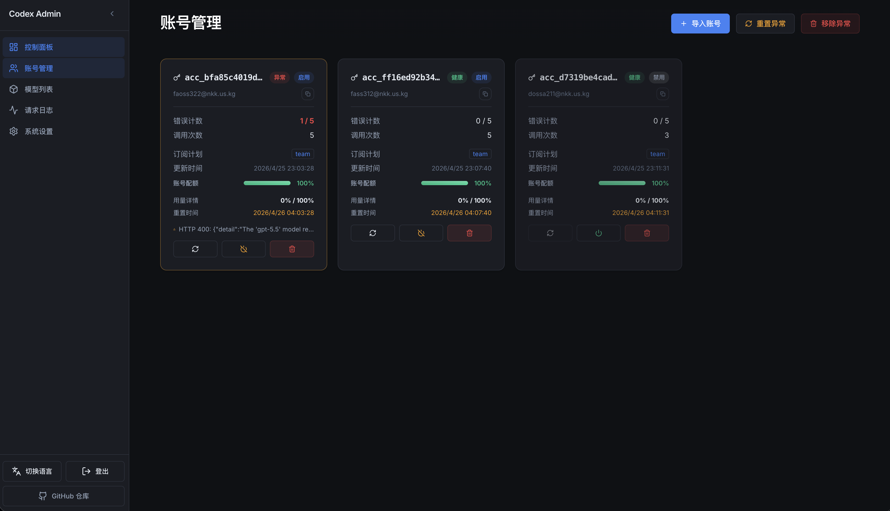
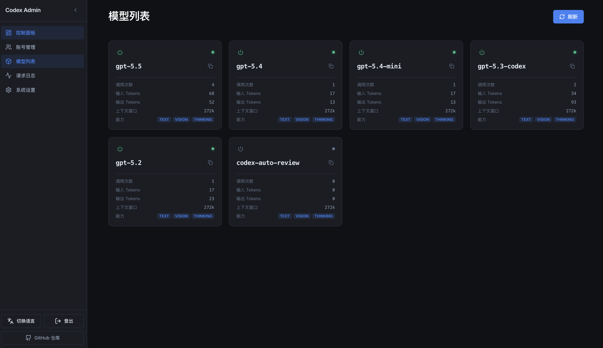
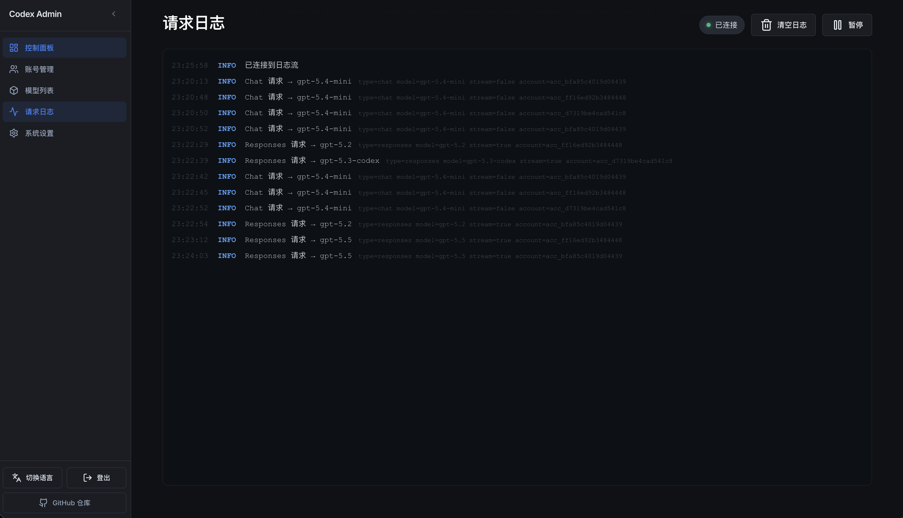
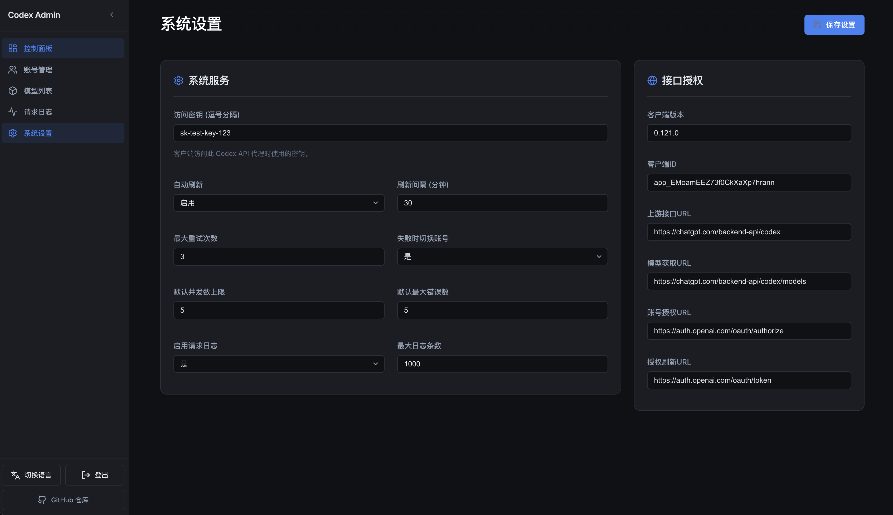
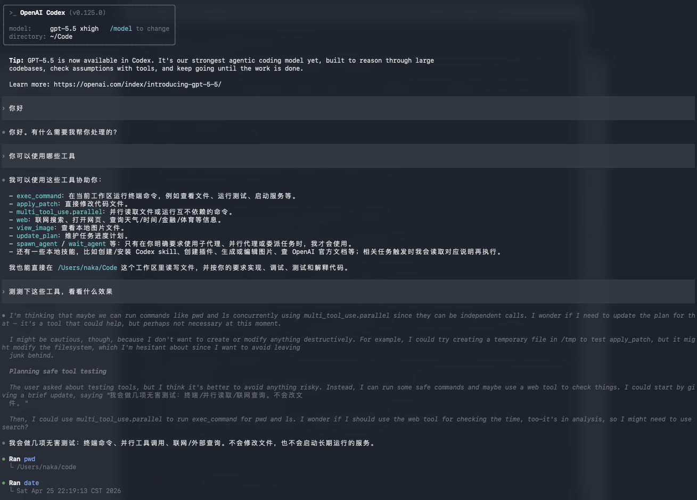

# Codex API

> 🚀 OpenAI API gateway for Codex

本项目是一个兼容 OpenAI 接口规范的轻量级 API 网关。自带了开箱即用的现代化 Web 管理面板，方便管理模型账号、系统动态配置以及监控请求运行状态。

## ✨ 核心特性

- **Responses API**: 原生支持 OpenAI `/v1/responses` 协议，作为对接 Codex 的核心调用方式，同时兼容传统 `/v1/chat/completions` 格式。
- **高可用账户矩阵**: 灵活的多账号池管理，按账号健康度与并发容量轮询分配请求，异常账号达到阈值后自动停用。
- **Token 托管**: 支持自动探测与刷新 OAuth Token，无缝维持会话健康度。
- **并发与限流**: 基于单账号细粒度的请求并发控制，避免上游触发频繁报错。
- **Web 管理**: 集成了现代化的 Vue3 管理后台（数据大屏、账户管理、会话调试）。

## 🖼️ 界面预览

### 控制台大屏


### 账号管理


### 模型配置


### 系统日志


### 系统设置


### 客户端集成示例 (Cherry Studio / Codex)




## ⚙️ 快速上手

### 1. 安装依赖

```bash
npm install
```

### 2. 配置环境

将配置文件模板复制一份并重命名为 `.env`：

```bash
cp .env.example .env
```

按需修改 `.env` 配置文件：

```env
PORT=3000
HOST=0.0.0.0
ADMIN_PASSWORD=your_admin_password
```

### 3. 本地开发

运行开发环境（支持热更新）：

```bash
npm run dev
```

### 4. 生产构建

前端与后端的统一构建：

```bash
npm run build
npm start
```

## 📦 生产环境部署

我们为您准备了两种可靠的服务器部署策略：

### 方案 A：Docker 容器化部署（强烈推荐）
通过 Docker Compose 能够以最快速度完成零依赖部署。在确保 `.env` 配置完毕后执行：

```bash
docker compose up -d --build
```

### 方案 B：PM2 部署（适用于低配 VPS）
对于内存只有 512MB / 1GB 的低配机器，可以通过 PM2 使用 `ecosystem.config.cjs` 以单实例控制内存运行：

```bash
# 全局安装 PM2
npm install -g pm2

# 构建项目源码
npm run build

# 启动 PM2 守护进程
pm2 start ecosystem.config.cjs

# 将 PM2 保存并加入系统开机自启
pm2 save
pm2 startup
```

## 📚 目录结构说明

- `/src`：后端核心逻辑代码（基于 Fastify 构建）。
- `/static`：构建后的前端管理界面静态资产。
- `/data`：持久化的会话及配置数据（由 Docker 挂载）。
- `/logs`：系统运行日志目录。

## 🔗 友情链接

<div align="center">
  <a href="https://linux.do/"></a>
</div>